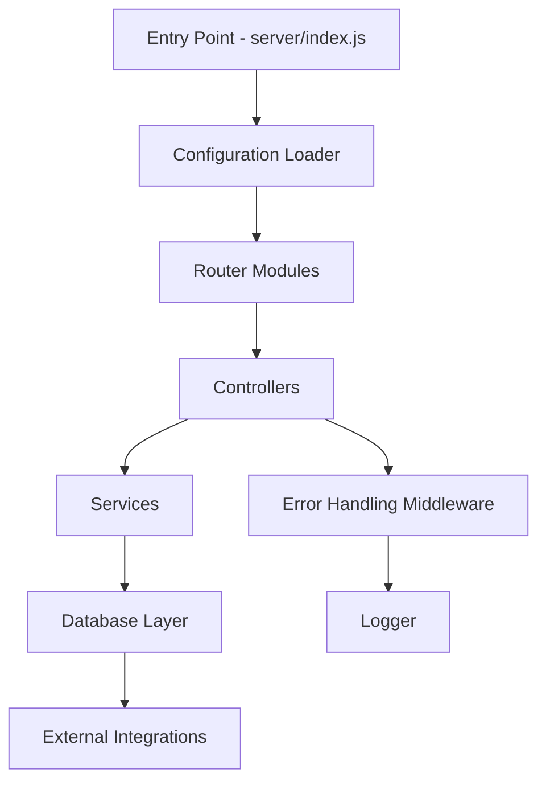

```

```# kul-kul

A robust codebase designed to support dynamic, modular applications. The `kul-kul` repository by Raditt10 focuses on extensibility, maintainability, and developer productivity. This project is ideal for building scalable services or web applications, enabling rapid development with a clean architecture.

## Introduction

`kul-kul` provides a foundation for developing modern software solutions. The architecture encourages separation of concerns, modular design, and easy integration with various tools and services. Whether you're building an internal tool, web service, or modular application, `kul-kul` delivers a flexible and reliable starting point.

## Features

- Modular architecture with clean separation of layers
- Support for environment-based configuration
- Easily extendable for new features or integrations
- Built-in development server support
- Robust error handling and logging
- Scalable structure for teams and solo developers

## Requirements

To run `kul-kul`, ensure you have the following:

- **Node.js** (version 14 or higher)
- **npm** or **yarn** (for dependency management)
- A UNIX-like OS (Linux, macOS) is preferred for compatibility
- Git (for version control)

## Installation

Follow these steps to get started:

1. **Clone the repository:**
    ```bash
    git clone https://github.com/Raditt10/kul-kul.git
    cd kul-kul
    ```
2. **Install dependencies:**
    ```bash
    npm install
    ```
    Or, if you prefer yarn:
    ```bash
    yarn install
    ```

3. **Copy the example environment file and adjust as needed:**
    ```bash
    cp .env.example .env
    # Edit the .env file to configure your environment variables
    ```

## Usage

The repository provides several scripts for development and production.

- **Start the development server:**
    ```bash
    npm run dev
    ```
- **Build for production:**
    ```bash
    npm run build
    ```
- **Start the production server:**
    ```bash
    npm start
    ```

### Common Commands

- **Run tests:**
    ```bash
    npm test
    ```
- **Lint the code:**
    ```bash
    npm run lint
    ```

## Configuration

Configuration is managed through environment variables, making it easy to adjust settings per environment.

- Create or update your `.env` file with the required settings.
- Typical configuration options include:
    - `PORT`: Port number for the server
    - `NODE_ENV`: Environment type (development, production, test)
    - Additional variables as needed for your integrations

**Example `.env` configuration:**
```
PORT=3000
NODE_ENV=development
```

## Project Architecture

The project follows a modular and layered structure. Below is an overview of the main components.



- **Entry Point:** Sets up environment, loads configuration, starts HTTP server.
- **Router Modules:** Define API routes and route handlers.
- **Controllers:** Handle request validation and business logic invocation.
- **Services:** Contain core business logic and interact with the database or external APIs.
- **Database Layer:** Abstraction for data persistence and retrieval.
- **Error Handling:** Centralized error processing and logging.

## API Endpoints

The repository provides a set of modular endpoints. Each endpoint is well-documented and follows REST conventions.

### Example: Get All Items (GET /items)

#### GET /items

```api
{
    "title": "Get All Items",
    "description": "Retrieve a list of all items.",
    "method": "GET",
    "baseUrl": "https://api.example.com",
    "endpoint": "/items",
    "headers": [],
    "queryParams": [],
    "pathParams": [],
    "bodyType": "none",
    "requestBody": "",
    "formData": [],
    "responses": {
        "200": {
            "description": "Success",
            "body": "{\n  \"data\": [\n    { \"id\": 1, \"name\": \"Item 1\" },\n    { \"id\": 2, \"name\": \"Item 2\" }\n  ]\n}"
        },
        "500": {
            "description": "Server Error",
            "body": "{\n  \"error\": { \"message\": \"Internal server error\" }\n}"
        }
    }
}
```

### Example: Create a New Item (POST /items)

```api
{
    "title": "Create Item",
    "description": "Create a new item.",
    "method": "POST",
    "baseUrl": "https://api.example.com",
    "endpoint": "/items",
    "headers": [
        {
            "key": "Content-Type",
            "value": "application/json",
            "required": true
        }
    ],
    "queryParams": [],
    "pathParams": [],
    "bodyType": "json",
    "requestBody": "{\n  \"name\": \"New Item\"\n}",
    "formData": [],
    "responses": {
        "201": {
            "description": "Created",
            "body": "{\n  \"data\": { \"id\": 3, \"name\": \"New Item\" }\n}"
        },
        "400": {
            "description": "Bad Request",
            "body": "{\n  \"error\": { \"message\": \"Validation failed\" }\n}"
        }
    }
}
```

## Contributing

Contributions are welcome and encouraged. Please follow these steps:

- Fork the repository and create your branch.
- Commit your changes clearly and concisely.
- Ensure code passes all linting and tests.
- Submit a pull request with a clear description.

### Code of Conduct

- Be respectful and inclusive.
- Provide constructive feedback in code reviews.
- Adhere to the repository’s coding standards.

### Issue Reporting

- Search existing issues before opening a new one.
- Provide detailed steps to reproduce problems.
- Suggest possible solutions if you have any ideas.

## License

This project is open source. See the LICENSE file for details.

---

For any additional questions or support, please open an issue or contact the repository maintainers.
